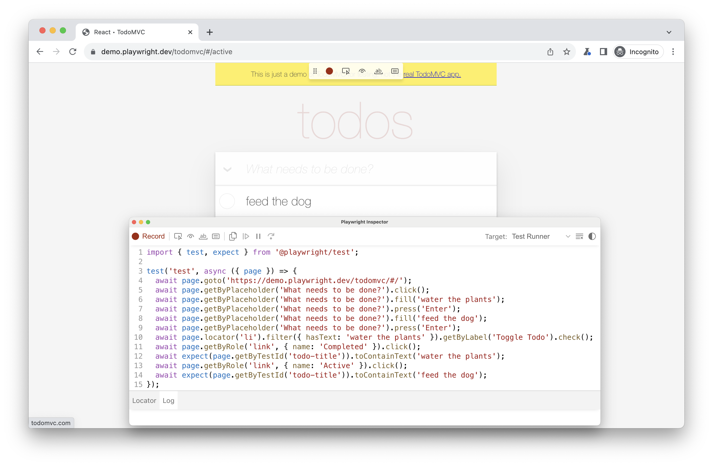
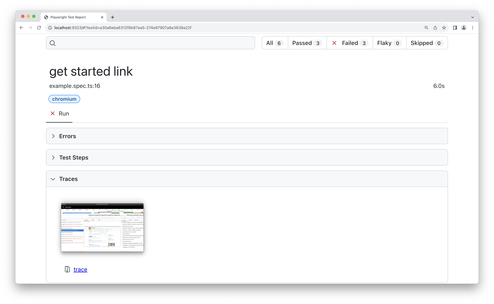

### Tooling
- Code Generator
- Debugging
- Trace Viewer
- UI mode

----
### Code Generator
* Two ways of generating testcases
* Codegen will try to implement Playwright's best practices when generating locators

----
### Codegen through CLI
```shell
npx playwright codegen demo.playwright.dev/todomvc
``` 


----
### Codegen with Vscode extension


----
### Debugging
* Various ways to debug tests
  * Breakpoints in VSCode when using the Playwright Test Extension
  * Playwright inspector (run tests with --debug flag). Set Breakpoints with ``await page.pause();``
  * UI mode where you can easily walk through each step of the test, see logs, errors, network requests, inspect the DOM snapshot 

----
### Trace Viewer
Playwright Trace Viewer is a GUI tool that lets you explore recorded Playwright traces of your tests meaning you can go back and forward through each action of your test and visually see what was happening during each action.
```ts []
import { defineConfig } from '@playwright/test';
export default defineConfig({
  retries: process.env.CI ? 1 : 0, // set to 1 when running on CI
  // ...
  use: {
    trace: 'retain-on-failure', // Retain traces on failure
  },
});
```
----
### Trace Viewer


----
### Trace Viewer


---
### UI Mode
* Run your testcases and inspect just about anything while the test is running!

```npx playwright test --ui```

