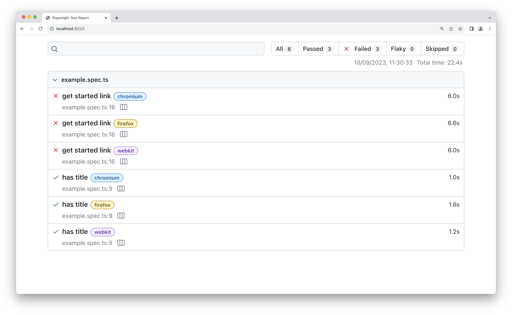
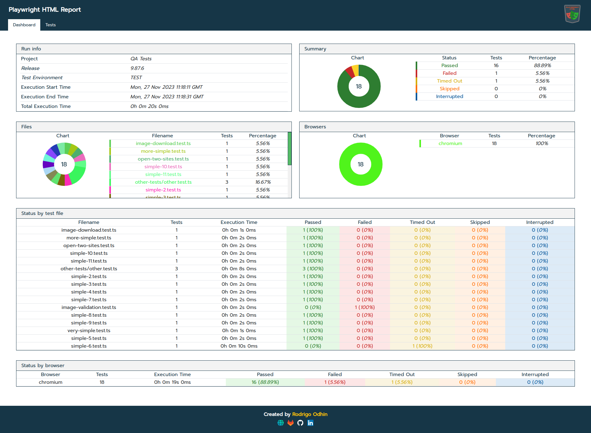

### Basic Usage

- Tests in Playwright
- Playwright API, interacting with your App.
- Locators & ElementHandles
- Web First Assertions
- Setup & Configuration
- Parallelization
- Reports

----
### Tests in Playwright
```ts []
import { test, expect } from '@playwright/test';

test('has title', async ({ page }) => {
  await test.step('Navigate to Playwright.dev', async () => {
      await page.goto('https://playwright.dev/'); 
  });
  await test.step('Page should have title', async () => {
      // Expect a title "to contain" a substring.
      await expect(page).toHaveTitle(/Playwright/);
  });
});
```

----
### Playwright API - Actions
```ts []
Text Input: fill('Peter');
checkbox: setChecked(true); 
Dropdown: selectOption('blue');
Click: click();
Key Presses: pressSequentially('Hello World!');
Key Pres: press('Enter');
Drag & Drop: dragTo(page.locator('#item-to-drop-at'));
File upload: setInputFiles(path.join(__dirname, 'myfile.pdf'));
```

> Before interacting with an element, Playwright will perform actionability checks, e.g. check visbility.

----
### Locators
Playwright offers two methods for referencing elements
* ElementHandles 👎
* Locators 👍

ElementHandles point to specific elements at a specific point in time. 
When Using Locators, an up-to-date element is fetched every single time you use it.

----
### Examples
```ts []
const handle = await page.$('text=Submit');
// ...
await handle.hover();
await handle.click();
```
```ts []
const locator = page.getByText('Submit');
// ...
await locator.hover();
await locator.click();
```

----
### Best Practices
* Test user-visible behavior
  * Prefer user-facing attributes to XPath or CSS selectors
* Make tests as isolated as possible 
* Avoid testing third-party dependencies, only test what _you_ control.


----
### Web First Assertions
* Regular Assertions usually only assert *once*
* Lazy loading or slower websites may result in *flaky* tests.
* Web First assertion(s) continously retry the assertion until the condition is met (or a timeout)
* Input for a web first assertion is a *locator*

----
### Web First Assertion - Example

```ts []
// 👍 Expect a locator to be visible
await expect(page.getByText('welcome')).toBeVisible(); 


// 👎 Expect true/false to be true
expect(await page.getByText('welcome').isVisible()).toBe(true);
```
It is considered a best practice to use web first assertions as much as possible!

----
### Playwright API - API Requests
```ts []
const REPO = 'test-repo-1';
const USER = 'github-username';

test('should create a bug report', async ({ request }) => {
  const newIssue = await request.post(`/repos/${USER}/${REPO}/issues`, {
    data: {
      title: '[Bug] report 1',
      body: 'Bug description',
    }
  });
  expect(newIssue.ok()).toBeTruthy();
  const JsonResp = await newIssue.json();
  console.log(JsonResp)
});
```
----
### Playwright API - API Requests
* Additional configuration for things like headers and authentication in `playwright.config.ts`
```ts []
import { defineConfig } from '@playwright/test';
export default defineConfig({
  use: {
    // All requests we send go to this API endpoint.
    baseURL: 'https://api.github.com',
    extraHTTPHeaders: {
      // We set this header per GitHub guidelines.
      'Accept': 'application/vnd.github.v3+json',
      // Add authorization token to all requests.
      // Assuming personal access token available in the environment.
      'Authorization': `token ${process.env.API_TOKEN}`,
    },
  }
});
```

----

### Setup & Configuration
* Initial set up as easy as running: `npm init playwright@latest`
* Configuration exposed through `TestConfig` in `playwright.config.ts`
    * Parallelization
    * Browsers
    * Reporters
    * Global Timeouts

----
### Parallelization

Playwright runs _files_ in parallel. Running _tests_ in parallel requires configuration

```ts [] 
import { test } from '@playwright/test';

test.describe.configure({ mode: 'parallel' });

test('runs in parallel 1', async ({ page }) => { /* ... */ });
test('runs in parallel 2', async ({ page }) => { /* ... */ });
```
```ts [] 
import { defineConfig } from '@playwright/test';

export default defineConfig({
  fullyParallel: true,
});
```

Note:
 that parallel tests are executed in separate worker processes and cannot share any state or global variables. Each test executes all relevant hooks just for itself, including beforeAll and afterAll.

----

### Reports - Configuring them
* You can either set the reporter through the CLI: ```npx playwright test --reporter=line```
* Or through the `playwright.config.ts`:
```ts []
import { defineConfig } from '@playwright/test';

export default defineConfig({
  reporter: [
    ['list'],
    ['json', {  outputFile: 'test-results.json' }]
  ],
});
```
* You can provide 1 or more reporters.

----
### HTML reporter
* Contains Test & Step Information
* If enabled, trace files per testcase.


----
#### Blob Reporter

* Outputs report in a blob
* Primairily used for merging multiple blobs to create a report afterwards.

----
#### Community Plugins


* Playwright HTML Reporter: https://rodrigoodhin.gitlab.io/playwright-html/#/1.1.5/screenshots


----
#### Assignment!

Checkout Repository: https://github.com/Ghislain89/PlaywrightWorkshop

Start webApp by running ```npm run dev```

The App should start on localhost:3000

----
#### Assignment!

* Write a testcase to automate the registration and login process for a new account.
* Set up Playwright to save HTML reports for your tests.
* Configure Playwright to always capture and store execution traces for better debugging and analysis.
* Duplicate the testcase a few times
* Enable parallel execution for these testcases

> I've already created page objects, we will use these later. Ignore them for now.
